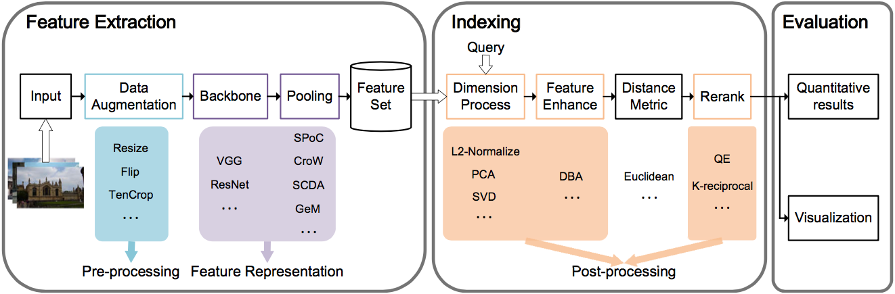

<p align="center">
    
</p>

# PyRetri

Benyi Hu, Ren-Jie Song, Xiu-Shen Wei*, Yazhou Yao, Xian-Sheng Hua, Yuehu Liu

Corresponding author: [Xiu-Shen Wei](http://www.weixiushen.com/)

## Introduction

PyRetri (pronounced as [ˈperɪˈtriː]) is a unified deep learning based unsupervised image retrieval toolbox built on PyTorch, which is designed for researchers and engineers.



### Major Features

PyRetri is a versatile  deep learning based unsupervised image retrieval toolbox designed with simplicity and flexibility in mind.

- **Modular Design**: We decompose the deep learning based unsupervised image retrieval into several stages and users can easily construct an image retrieval pipeline by selecting and combining different modules.
- **Flexible Loading**: The toolbox is able to adapt to load several types of model parameters, including parameters with the same keys and shape, parameters with different keys, and parameters with the same keys but different shapes.
- **Support of  Multiple Methods**: The toolbox directly supports several popluar methods designed for deep learning based unsupervised image retrieval, which is also suitable for person re-identification.
- **Configuration Search Tool**: We provide the configuration search tool to help users to find the optimal retrieval configuration with various hyper-parameters. 

### Supported Methods

The toolbox supports popluar and prominent methods of unsupervised image retrieval and users can also design and add their own modules.

- **Pre-processing**
  - DirectResize, PadResize, ShorterResize
  - CenterCrop, TenCrop
  - TwoFlip
  - ToTensor, ToCaffeTensor
  - Normalize
- **Feature Representation**
  - Global Average Pooling (GAP), Global Max Pooling (GMP)
  - [R-MAC](https://arxiv.org/pdf/1511.05879.pdf), [SPoC](https://arxiv.org/pdf/1510.07493.pdf), [CroW](https://arxiv.org/pdf/1512.04065.pdf), [GeM](https://arxiv.org/pdf/1711.02512.pdf), [SCDA](http://www.weixiushen.com/publication/tip17SCDA.pdf), [PWA](https://arxiv.org/abs/1705.01247)
  - [PCB](http://openaccess.thecvf.com/content_ECCV_2018/papers/Yifan_Sun_Beyond_Part_Models_ECCV_2018_paper.pdf)
- **Post-processing**
  - [SVD](https://link.springer.com/chapter/10.1007%2F978-3-662-39778-7_10), [PCA](http://pzs.dstu.dp.ua/DataMining/pca/bibl/Principal%20components%20analysis.pdf)
  - [DBA](https://www.robots.ox.ac.uk/~vgg/publications/2012/Arandjelovic12/arandjelovic12.pdf)
  - [QE](https://www.robots.ox.ac.uk/~vgg/publications/papers/chum07b.pdf), [K-reciprocal](https://arxiv.org/pdf/1701.08398.pdf)

## Updates

 **06 May 2020:** Our paper is online, you are welcomed to download the paper at [here](https://128.84.21.199/abs/2005.02154).

 **29 April 2020:** Our PyRetri is launched!

## Installation

Please refer to [INSTALL.md](docs/INSTALL.md) for installation and dataset preparation.

## Get Started

Please see [GETTING_STARTED.md](docs/GETTING_STARTED.md) for the basic usage of PyRetri.

## Model Zoo

Results and models are available in [MODEL_ZOO.md](docs/MODEL_ZOO.md).

## License

This project is released under the [Apache 2.0 license](LICENSE).

## Citation

If you use this toolbox in your research, please cite this paper.

```
@inproceedings{Hu2020PyRetri,
  author    = {Benyi Hu and Ren{-}Jie Song and
               Xiu{-}Shen Wei and Yazhou Yao and
               Xian{-}Sheng Hua and Yuehu Liu},
  title     = {PyRetri: {A} PyTorch-based Library for Unsupervised Image Retrieval
               by Deep Convolutional Neural Networks},
  booktitle = {{ACM} International Conference on Multimedia ({ACM MM})},
  pages     = {4461--4464},
  year      = {2020},
}
```

## Contacts

If you have any questions about our work, please do not hesitate to contact us by emails.

Xiu-Shen Wei: [weixs.gm@gmail.com](mailto:weixs.gm@gmail.com)

Benyi Hu: [hby0906@stu.xjtu.edu.cn](mailto:hby0906@stu.xjtu.edu.cn)

Renjie Song: [songrenjie@megvii.com](mailto:songrenjie@megvii.com)

## Acknowledgements

This project is supported by the Fundamental Research Funds for the Central Universities, No. 30920041111.


